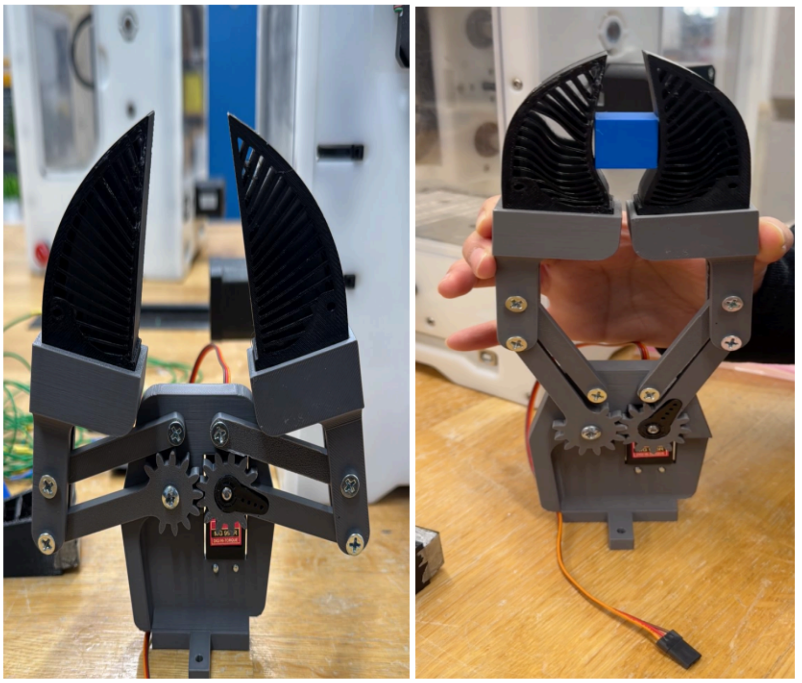
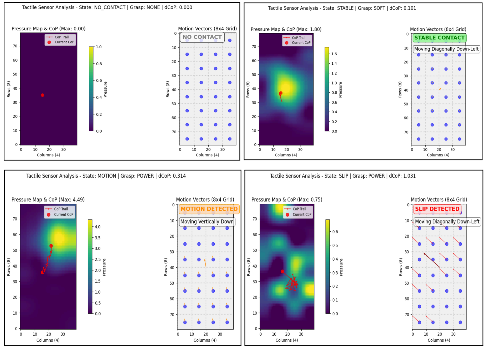

# Visuo-Tactile Sensing

A fin ray-inspired tactile sensing system for robotic manipulation that integrates a compliant TPU gripper with a tactile sensor array.

# Visuo-Tactile Sensing

A fin ray-inspired tactile sensing system for robotic manipulation that integrates a compliant TPU gripper with a tactile sensor array.

<p align="center">
  
</p>

<p align="center">
  
</p>

## Project Overview

This project presents a novel approach to robotic manipulation by combining the adaptive grasping capabilities of fin ray-inspired grippers with integrated tactile sensing. The system features:

- 3D printed fin ray structures using flexible TPU material
- Tactile sensor matrix (8x4) composed of copper tape and velostat
- Mechanical parallelogram driven by a high-torque servo
- Real-time tactile feedback processing and grip adjustment

The integration enables:
- Passive adaptation to various object geometries
- Collection of tactile feedback during manipulation
- Automatic grip strength adjustment based on detected slip or motion

## System Architecture

### Hardware Components
- Parallax Propeller microcontroller
- CD74HC4067 16-channel analog multiplexer
- 8x4 tactile sensor grid (copper tape + velostat)
- High-torque servo motor
- TPU 3D printed fin ray gripper

### Software Architecture
- **Propeller Cog 0**: Sensor acquisition and data transmission
- **Propeller Cog 1**: Command reception, parsing, and servo control
- **Python Application**: Data processing, visualization, and state classification

## Getting Started

### Prerequisites

#### Hardware Setup
1. Assemble the tactile sensor grid using copper tape arranged in an 8x4 matrix with velostat
2. Connect the multiplexer (CD74HC4067) to the sensor columns
3. Wire the Propeller according to the pin assignments in the code
4. Connect the servo to Pin 16 on the Propeller

#### Software Prerequisites
1. [SimpleIDE](https://learn.parallax.com/tutorials/language/propeller-c/propeller-c-set-simpleide)
2. Python 3.8+ with the following packages:
   - numpy
   - matplotlib
   - opencv-python (cv2)
   - pyserial
   - scipy

### Installation

#### Propeller Code Setup

1. Download and install SimpleIDE from [Parallax's website](https://learn.parallax.com/tutorials/language/propeller-c/propeller-c-set-simpleide)

2. Install the required libraries:
   - Download the [SimpleTools library](https://learn.parallax.com/tutorials/language/propeller-c/propeller-c-libraries/simpletools-library)
   - Download the [ADCDCpropab library](https://learn.parallax.com/tutorials/language/propeller-c/propeller-c-libraries/adcdcpropab-library)
   - Download the [fdserial library](https://learn.parallax.com/tutorials/language/propeller-c/propeller-c-libraries/fdserial-library)
   - Download the [servo library](https://learn.parallax.com/tutorials/language/propeller-c/propeller-c-libraries/servo-library)

3. Import the libraries into SimpleIDE:
   - Open SimpleIDE
   - Go to `Project > Properties`
   - Under `Compiler Options`, add paths to the downloaded libraries

4. Clone this repository:
   ```bash
   git clone https://github.com/username/visuo-tactile-sensing.git
   cd visuo-tactile-sensing
   ```

5. Open the `tactile_servo_control_v3.c` file in SimpleIDE

#### Python Setup

1. Install required Python packages:
   ```bash
   pip install numpy matplotlib opencv-python pyserial scipy
   ```

2. Configure the serial port in the Python script:
   ```python
   # Change to your COM port
   serial_port = 'COM3'  # Windows example
   # serial_port = '/dev/ttyUSB0'  # Linux example
   # serial_port = '/dev/tty.usbserial-*'  # macOS example
   ```

## Usage

### Running the System

1. Connect the Propeller board to your computer via USB
2. Compile and upload the C code to the Propeller using SimpleIDE
3. Run the Python script to start the visualization and control system:
   ```bash
   python run_tracker_with_force_estimation.py
   ```

### Serial Communication

- The system uses a baud rate of 115200
- Communication format from Python to Propeller: `"STATE,GRASP_TYPE\n"`
- Example commands: `"STABLE,SOFT\n"`, `"NO_CONTACT,NONE\n"`, `"SLIP,POWER\n"`

## Debugging

### Serial Connection Issues

1. Verify correct COM port:
   - Windows: Check Device Manager > Ports (COM & LPT)
   - Linux: `ls /dev/tty*`
   - macOS: `ls /dev/tty.*`

2. Confirm baud rate settings (should be 115200)

3. Test serial connection with:
   ```python
   import serial
   ser = serial.Serial('COM3', 115200, timeout=1)
   ser.write(b"RESET,NONE\n")
   print(ser.readline())
   ser.close()
   ```

### Sensor Reading Issues

1. Check sensor connections to multiplexer
2. Verify multiplexer control pins are connected to P0, P1, P2
3. Ensure multiplexer enable pin is connected to P14
4. Look for debug messages during calibration

### Gripper Movement Issues

1. Verify servo is connected to P16
2. Check servo power supply (separate from logic power)
3. Test servo with direct commands:
   ```
   servo_angle(16, 500)  // Open position
   pause(1000)
   servo_angle(16, 1700)  // Closed position
   ```

## State Machine

The system implements the following states:
- `NO_CONTACT`: Gripper closing until contact is detected
- `INITIAL_CONTACT`: First detection of object
- `STABLE`: Maintained contact with minimal movement
- `MOTION`: Object is moving but still controlled
- `SLIP`: Object is slipping and requires immediate response
- `RESET`: Command to open the gripper

## Contributors

- Amey Joshi
- Hrishitaa Kurchaina
- Dana Sy-Ching

## License

This project is licensed under the MIT License - see the LICENSE file for details.
